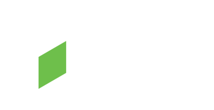
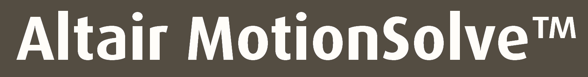

<!--VVVV_SVP_BALA-->

  

###

 
  
  

###

<h1 align="center">Hey!! 👋, I'm Karthikeyan </h1>

###

<h3 align="left">👩‍💻  About Me</h3>

###

Having 9+ years of experience in Product Design, FEA, MBD, Durability and NVH Simulaions across diverse industries.   - 🔭 Currently, working as CAE Engineer in Gabriel India Limited, Hosur.  - 📚 Subject Matter Expert in Automobile Suspension.  - ⚡ Dedicated to learning, innovating and optimizing resources in every endeavour.  - 📫 Feel free to reach out for any Freelance Projects. - 💬 Email: karthikeyanvlr24@gmail.com 

###

<h3 align="left">🛠 Software Tools </h3>

###

  
  
  
  
  
  

###

<h3 align="left">🛠 Programming Languages</h3>

###

  
  
  
  
  
  

